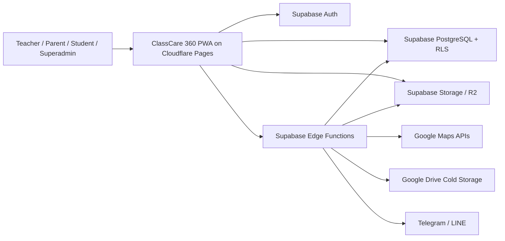
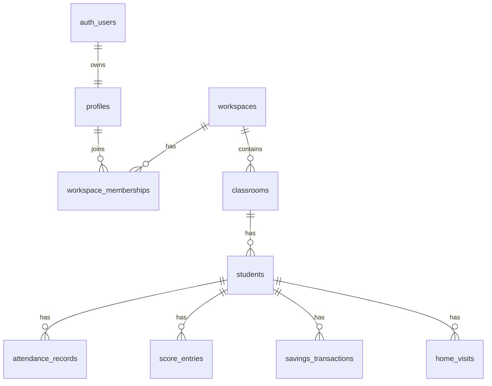
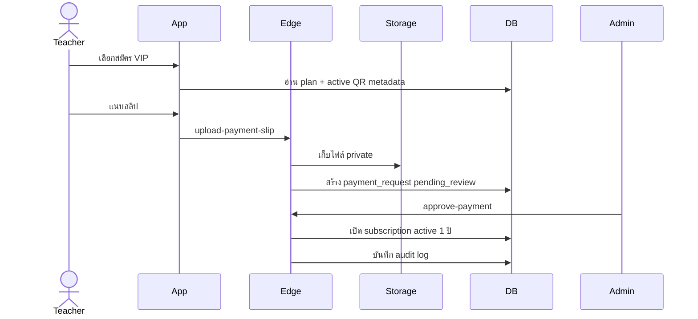

# ClassCare 360 Architecture

อัปเดตล่าสุด: 2026-06-24  
สถานะ: Phase 1 design draft  
อ้างอิง: `Prompt.txt`

## เป้าหมายระบบ

ClassCare 360 คือเว็บแอปผู้ช่วยครูและดูแลนักเรียนครบวงจร รองรับครูหลายโรงเรียน แยกข้อมูลด้วย `workspace_id` มี Superadmin ดูแลระบบใหญ่ มีแพ็กเกจพรีเมียม `ClassCare 360 VIP` สำหรับการใช้งานโมดูลหลัก และรองรับการติดตั้งเป็น PWA

หลักสำคัญ:

- ระบบหลักใช้ชื่อ `ClassCare 360`
- คำว่า `VIP` ใช้เฉพาะบริบทแพ็กเกจ การสมัคร ต่ออายุ สิทธิ์พิเศษ และฟีเจอร์พรีเมียม
- ข้อมูลทุก workspace ต้องแยกกันเด็ดขาด
- RLS เป็น boundary หลักของข้อมูล
- service role ใช้เฉพาะ backend หรือ Edge Functions เท่านั้น
- ห้าม hard-code secret, QR Code, token, password หรือ API key ใน frontend
- ภาษาไทยเป็นหลัก และ timezone เป็น `Asia/Bangkok`

## Technology Stack

Frontend:

- React + Vite
- TypeScript
- Tailwind CSS หรือ CSS system ที่แยก token ชัดเจน
- PWA manifest, service worker, offline page

Hosting:

- Cloudflare Pages สำหรับ frontend
- Cloudflare custom domain และ Pages environment variables

Backend:

- Supabase PostgreSQL
- Supabase Auth
- Supabase Storage
- Supabase Edge Functions สำหรับงานที่ต้องใช้ secret หรือ service role
- Cloudflare Workers ใช้เสริมได้เมื่อจำเป็น เช่น webhook gateway หรือ rate-limit edge

Integrations:

- Google OAuth ผ่าน Supabase Auth
- Google Drive OAuth แยก flow หลังผู้ใช้เลือกเชื่อม Drive
- Google Maps JavaScript API, Geocoding API, Routes API
- Telegram Bot API
- LINE Messaging API / LINE Official Account
- PDF/XLSX generation ผ่าน Edge Functions

## High-Level System Diagram

## Application Layers

### 1. Presentation Layer

หน้าที่:

- แสดง UI ภาษาไทย
- จัด route ตาม role และ subscription
- ทำ client-side validation เพื่อ UX ที่ดี
- แสดง loading, empty, error, toast, confirm dialog
- ไม่เก็บ secret หรือ service role
- ไม่โหลดข้อมูลทั้งหมดในครั้งเดียว
- ไม่ cache PII ใน service worker แบบไม่ปลอดภัย

ตัวอย่าง route group:

- Public/Auth: `/login`, `/register`, `/pricing`, `/privacy`, `/refund-policy`
- App: `/app/dashboard`, `/app/students`, `/app/attendance`, `/app/reports`
- Superadmin: `/superadmin/dashboard`, `/superadmin/payments`, `/superadmin/audit-logs`
- Portal: `/portal/parent`, `/portal/student`

### 2. Access Layer

หน้าที่:

- Supabase client ใช้ anon key เท่านั้น
- Route guard ตรวจ session, workspace membership, role, subscription, module entitlement
- Backend functions ตรวจซ้ำก่อนทำ action สำคัญ
- RLS เป็น enforcement สุดท้ายใน database

ทุก action ต้องผ่านคำถาม:

1. login แล้วหรือยัง
2. อยู่ใน workspace นี้หรือไม่
3. subscription active หรือไม่
4. package เปิด module นี้หรือไม่
5. role มีสิทธิ์ทำ action นี้หรือไม่
6. ใช้งานเกิน limit หรือไม่

### 3. Domain Layer

กลุ่ม domain หลัก:

- Auth and profile
- Workspace and school settings
- Subscription and package entitlement
- Payment, refund, referral
- Student management
- Attendance
- Scores, indicators, tasks, missing work
- Savings and carry forward
- Behavior
- Student care
- Home visit and maps
- Parent contact, consent forms, appointments
- Reports
- Import/export
- Backup/restore/archive
- Notifications
- Superadmin operations

### 4. Data Layer

หลักการ:

- ทุกตารางหลักที่เป็นข้อมูลของโรงเรียน/ครูต้องมี `workspace_id`
- ตารางข้อมูลละเอียดต้องมี indexes ตาม `workspace_id`, ปีการศึกษา, ห้องเรียน, วันที่ หรือ student
- ตารางขนาดใหญ่ต้องใช้ pagination และ filter
- Dashboard ใช้ summary tables หรือ materialized summary pattern
- Audit log และ edit history เก็บ action สำคัญทุกจุด

### 5. Server Function Layer

ใช้ Edge Functions เมื่อ:

- ต้องใช้ service role
- ต้องใช้ secret integration
- ต้องประมวลผลไฟล์
- ต้อง generate PDF/XLSX
- ต้องส่ง notification
- ต้องอนุมัติ payment/refund
- ต้องเรียก Google Drive/Maps/Telegram/LINE

ตัวอย่าง functions กลุ่มแรก:

- `create-payment-request`
- `upload-payment-slip`
- `approve-payment`
- `reject-payment`
- `request-refund`
- `send-notification`
- `generate-report-pdf`
- `generate-report-xlsx`
- `import-xlsx-preview`
- `import-xlsx-confirm`
- `backup-workspace`
- `update-student-home-location`
- `calculate-student-home-distance`

## Multi-Tenant Model

หน่วยหลักคือ `workspace`

- 1 user มีหลาย workspace ได้
- 1 workspace แทนโรงเรียน/ชุดข้อมูลของครู
- Membership ผูก user กับ workspace และ role
- ทุก query หลักต้อง filter ด้วย workspace
- RLS บังคับว่า user เห็นเฉพาะ workspace ที่เป็นสมาชิก
- Superadmin เห็น metadata ระบบได้ แต่การเปิดดูข้อมูลจริงของ workspace ต้องมี audit log

## Role Model

Roles:

- `superadmin`
- `teacher_owner`
- `teacher_member`
- `parent`
- `student`
- `viewer`

Role notes:

- `superadmin` จัดการระบบใหญ่, plan, QR Code, payment, refund, maintenance, health, audit logs
- `teacher_owner` เป็นเจ้าของ workspace จัดการโรงเรียน ห้องเรียน นักเรียน และ invite ครูร่วมตามแพ็กเกจ
- `teacher_member` ใช้เฉพาะห้อง/วิชา/สิทธิ์ที่ได้รับ
- `parent` ดูเฉพาะข้อมูลบุตรหลานของตนเอง
- `student` ดูเฉพาะข้อมูลตนเอง
- `viewer` ดูรายงานได้อย่างเดียว

## Subscription and Entitlement Model

Plans:

- `FREE_LOGIN`: login ได้อย่างเดียว ดู package/account/payment/support ได้ แต่ใช้โมดูลหลักไม่ได้
- `TRIAL_30`: ทดลอง 30 วัน ใช้ได้จำกัด ใช้ได้ 1 ครั้งต่อ user/workspace
- `VIP_YEARLY`: ราคา 100 บาท/ปี เปิดทุกโมดูลตาม Prompt

Entitlement check ทำ 2 ชั้น:

- Frontend route/menu guard เพื่อซ่อนหรือ lock เมนู
- Backend/RLS/function guard เพื่อ enforce จริง

สถานะบัญชี:

- `registered`
- `pending_approval`
- `trial`
- `active`
- `expired`
- `suspended`
- `cancelled`

สถานะ subscription:

- `trial`
- `active`
- `expired`
- `suspended`
- `cancelled`
- `refunded`

## Payment and Refund Architecture

หลักสำคัญ:

- QR Code ต้องมาจาก setting ที่ Superadmin อัปโหลด ห้าม hard-code
- Slip เก็บใน private bucket
- Slip URL ต้องใช้ signed URL
- รูป slip ต้อง resize, convert webp, remove EXIF ก่อนเก็บ
- Payment approve/reject ทำผ่าน Edge Function เท่านั้น
- Refund ต้อง reverse subscription และ referral credit ที่เกี่ยวข้อง

Payment flow:

## Notification Architecture

Channels:

- In-App
- Telegram Bot
- LINE Messaging API / LINE Official Account
- Email ในอนาคต
- Web Push ในอนาคต

ข้อควรระวัง:

- ห้ามส่งพิกัดบ้านละเอียดผ่าน Telegram/LINE
- ข้อมูลส่วนบุคคลควรถูก mask หรือย่อให้พอดีกับบริบท
- token integration ต้อง encrypt
- Notification delivery ควรมี queue/status/retry

## Storage Architecture

Storage layers:

- Supabase Storage หรือ R2 สำหรับไฟล์ใช้งานปัจจุบัน
- Google Drive ของผู้ใช้สำหรับ cold storage หลังผู้ใช้เชื่อมต่อเอง

Bucket groups:

- `payment-qr-codes` สำหรับ QR Code
- `payment-slips` private
- `student-files` private
- `report-exports` private
- `import-files` private
- `backup-exports` private
- `public-assets` สำหรับ asset ที่เผยแพร่ได้

ไม่เก็บ:

- base64 image/file ใน database
- ไฟล์ต้นฉบับใหญ่โดยไม่จำเป็น
- secret ใน frontend

## Performance Design

หลักการ:

- Query เฉพาะ workspace
- Query เฉพาะปี/ห้อง/ช่วงวันที่
- Pagination ทุกตารางใหญ่
- Debounced search
- Lazy loading route/module
- Batch insert/update
- Upsert คะแนนและ import
- Summary tables สำหรับ dashboard
- Index ตาม pattern ใช้งานจริง
- Avoid N+1 query
- Cache static data แบบปลอดภัย
- Cache Google Maps distance เพื่อลดค่า API

## Deployment Architecture

ลำดับ deploy:

1. สร้าง Supabase project
2. ตั้งค่า environment variables
3. รัน migration
4. เปิด RLS และ policies
5. ตั้งค่า storage buckets
6. Deploy Edge Functions
7. ตั้งค่า Google OAuth
8. ตั้งค่า Telegram/LINE
9. ตั้งค่า Google Drive OAuth
10. ตั้งค่า Google Maps API
11. Deploy Cloudflare Pages
12. ตั้งค่า custom domain
13. สร้าง superadmin คนแรก
14. ตั้ง QR Code และ plans เริ่มต้น
15. ทดสอบสมัคร/ชำระเงิน/อนุมัติ VIP

## First Implementation Milestone

Milestone แรกที่ควรทำหลังเอกสารชุดนี้:

- เพิ่ม `.env.example`
- สร้าง Supabase migration ชุด core
- สร้าง `profiles`, `workspaces`, `workspace_memberships`, `plans`, `subscriptions`, `audit_logs`
- เพิ่ม RLS helper functions
- เพิ่ม seed plan เริ่มต้น
- ทำ frontend shell ให้ build ผ่าน
