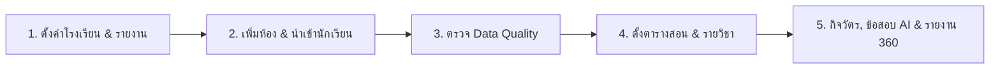

# คู่มือการใช้งานระบบ ClassCare 360 ฉบับสมบูรณ์ (Complete System Manual)

> **ระบบผู้ช่วยครูและดูแลช่วยเหลือนักเรียน 360 องศา ยกระดับงานวิชาการด้วย AI อัจฉริยะ**  
> *รองรับทั้งการใช้งานบนคอมพิวเตอร์ แท็บเล็ต และสมาร์ทโฟนเต็มรูปแบบ (Responsive & Super-App Mobile Dock)*

---

## สารบัญ (Table of Contents)

1. [ภาพรวมระบบและสถาปัตยกรรม (System Overview)](#1-ภาพรวมระบบและสถาปัตยกรรม)
2. [การเริ่มต้นใช้งาน 5 ขั้นตอน (5-Step Quick Start Roadmap)](#2-การเริ่มต้นใช้งาน-5-ขั้นตอน)
3. [ระบบผู้ช่วย AI อัจฉริยะ (AI Intelligence Hub)](#3-ระบบผู้ช่วย-ai-อัจฉริยะ)
   - 3.1 [ศูนย์ออกแบบข้อสอบกลางภาค/ปลายภาค สพฐ. (Semester Exam Generator)](#31-ศูนย์ออกแบบข้อสอบกลางภาคปลายภาค-สพฐ)
   - 3.2 [ศูนย์สร้างเกณฑ์ประเมินรูบริก 4 ระดับ (Rubric Assessment Generator)](#32-ศูนย์สร้างเกณฑ์ประเมินรูบริก-4-ระดับ)
   - 3.3 [ระบบทดสอบย่อยซ่อมเสริม (Remedial Quiz Generator)](#33-ระบบทดสอบย่อยซ่อมเสริม)
   - 3.4 [แชทบอทน้องแคร์ AI & ผู้ช่วยตารางสอนอัจฉริยะ (Nong Care Classroom Assistant)](#34-แชทบอทน้องแคร์-ai--ผู้ช่วยตารางสอนอัจฉริยะ)
4. [ประสบการณ์ใช้งานบนมือถือระดับ Super-App (Mobile Super-App Dock)](#4-ประสบการณ์ใช้งานบนมือถือระดับ-super-app)
5. [ระบบตารางสอนและปฏิทินโรงเรียน (Schedule & School Calendar)](#5-ระบบตารางสอนและปฏิทินโรงเรียน)
   - 5.1 [ปฏิทินโรงเรียน (School Calendar with Activity Dots)](#51-ปฏิทินโรงเรียน)
   - 5.2 [ตารางสอนรายคาบและห้องเรียน (Teacher Schedule & Class Periods)](#52-ตารางสอนรายคาบและห้องเรียน)
6. [ระบบข้อมูลนักเรียน 360 และการดูแลช่วยเหลือ (Student 360 & Student Care)](#6-ระบบข้อมูลนักเรียน-360-และการดูแลช่วยเหลือ)
   - 6.1 [การนำเข้าข้อมูลนักเรียนและ DMC Excel (DMC Import & Data Quality)](#61-การนำเข้าข้อมูลนักเรียนและ-dmc-excel)
   - 6.2 [ทะเบียนประวัตินักเรียนและเคสดูแล (Student Profile & Care Lifecycle)](#62-ทะเบียนประวัตินักเรียนและเคสดูแล)
   - 6.3 [ระบบบันทึกการเยี่ยมบ้าน กสศ.01 และพิมพ์ PDF (Home Visit & Kor Sor Sor 01)](#63-ระบบบันทึกการเยี่ยมบ้าน-กสศ01-และพิมพ์-pdf)
7. [ระบบงานครูประจำวัน กิจวัตร และกิจกรรมในชั้นเรียน (Teacher Routine & Activities)](#7-ระบบงานครูประจำวัน-กิจวัตร-และกิจกรรมในชั้นเรียน)
   - 7.1 [เช็กชื่อการมาเรียนและส่งแจ้งเตือนผู้ปกครอง (Attendance & Notifications)](#71-เช็กชื่อการมาเรียนและส่งแจ้งเตือนผู้ปกครอง)
   - 7.2 [สมุดเงินออมนักเรียน (Classroom Savings)](#72-สมุดเงินออมนักเรียน)
   - 7.3 [บันทึกพฤติกรรมเชิงบวก/ข้อห่วงใย (Behavior Tracking)](#73-บันทึกพฤติกรรมเชิงบวกข้อห่วงใย)
   - 7.4 [วงล้อสุ่มนักเรียนและจัดกลุ่มกิจกรรม (Classroom Randomizer & Grouping)](#74-วงล้อสุ่มนักเรียนและจัดกลุ่มกิจกรรม)
8. [ระบบสมุดบันทึกผลการเรียนและการตัดเกรด (Score Book & Grading)](#8-ระบบสมุดบันทึกผลการเรียนและการตัดเกรด)
9. [ศูนย์เอกสารราชการและรายงาน ปพ. (Official Reports & Por Por Export)](#9-ศูนย์เอกสารราชการและรายงาน-ปพ)
10. [ระบบบริหารจัดการโรงเรียนและความปลอดภัย (Administration & Data Safety)](#10-ระบบบริหารจัดการโรงเรียนและความปลอดภัย)
11. [คำถามที่พบบ่อยและแนวทางแก้ไขปัญหา (FAQ & Troubleshooting)](#11-คำถามที่พบบ่อยและแนวทางแก้ไขปัญหา)

---

## 1. ภาพรวมระบบและสถาปัตยกรรม

ClassCare 360 ถูกออกแบบขึ้นเพื่อแก้ปัญหาความซ้ำซ้อนในงานเอกสารของคุณครูและโรงเรียนไทย โดยผนวกระบบงานกิจวัตรประจำวัน งานวิชาการ การประเมินผลตามหลักสูตรแกนกลางการศึกษาขั้นพื้นฐาน (สพฐ.) และเทคโนโลยี AI Generative (Google Gemini 2.5 Flash) เข้าด้วยกันอย่างสมบูรณ์แบบ

### จุดเด่นเชิงสถาปัตยกรรม (Key Architectural Highlights)
- **High Performance Frontend:** พัฒนาด้วย React 18 + Vite + TypeScript พร้อม Tailwind CSS โทน MIKPURINUT Glassmorphism สะอาดตาและประมวลผลฉับไว
- **Real-time Backend & Security:** ขับเคลื่อนด้วย Supabase (PostgreSQL) พร้อมระบบความปลอดภัย Row Level Security (RLS) แยกสิทธิ์ข้อมูลระหว่างโรงเรียนและชั้นเรียนอย่างปลอดภัย 100%
- **Dual Offline/Online Hybrid:** รองรับการทำงานในภาวะออฟไลน์ชั่วคราวผ่าน Local Storage Caching และ PWA Service Worker
- **AI-Powered OBEC Curriculum Integration:** วิเคราะห์ตัวชี้วัด สพฐ. สร้างผังข้อสอบ (Test Blueprint) และสร้างข้อสอบพร้อมเฉลยในมาตรฐานราชการโดยอัตโนมัติ

---

## 2. การเริ่มต้นใช้งาน 5 ขั้นตอน

เพื่อให้การทำงานทุกส่วนเชื่อมโยงกันอย่างสมบูรณ์ ขอแนะนำให้ดำเนินการตามลำดับขั้นตอนนี้ในการเปิดใช้งานโรงเรียน/ห้องเรียนใหม่:



1. **ตั้งค่าโรงเรียนและรายงาน:** กรอกชื่อสถานศึกษา รหัสโรงเรียน ปีการศึกษา ตราสัญลักษณ์ (Logo) และกำหนดชื่อ-ตำแหน่งของผู้ลงนาม 4 ฝ่าย (ครูประจำชั้น, หัวหน้างานวิชาการ, นายทะเบียน, ผู้อำนวยการ)
2. **เพิ่มห้องเรียนและนำเข้านักเรียน:** สร้างห้องเรียน (เช่น ป.1/1, ม.3/2) แล้วนำเข้ารายชื่อผ่านไฟล์สำรวจข้อมูลนักเรียน DMC Excel หรือไฟล์ CSV
3. **ตรวจสอบคุณภาพข้อมูล (Data Quality):** ใช้เครื่องมือตรวจชื่อซ้ำ เลขประจำตัวประชาชน 13 หลัก ตรวจสอบนักเรียนตกหล่น เพื่อให้ฐานข้อมูลพร้อมสำหรับการออกเอกสาร ปพ.
4. **ตั้งตารางสอนและรายวิชา:** บันทึกรายวิชา คาบเรียน เวลาเริ่ม-สิ้นสุด และห้องเรียน เพื่อให้ระบบแจ้งเตือนและเชื่อมโยงกับผู้ช่วยตารางสอน AI
5. **เริ่มงานกิจวัตร, ข้อสอบ AI และออกรายงาน:** บันทึกเวลาเรียน กรอกคะแนน สร้างข้อสอบด้วย AI สรุปผลการประเมิน และออกรายงาน ปพ.5 / ปพ.6 ได้ทันที

---

## 3. ระบบผู้ช่วย AI อัจฉริยะ

ระบบ ClassCare 360 ผสานความสามารถของ AI สพฐ. เพื่อลดภาระงานครูในการจัดทำข้อสอบและเครื่องมือวัดผล:

### 3.1 ศูนย์ออกแบบข้อสอบกลางภาค/ปลายภาค สพฐ.
*(เข้าถึงได้จากเมนู: สมุดคะแนน -> แถบ "ศูนย์ออกแบบข้อสอบ & รูบริก สพฐ." หรือปุ่มลัดในเมนู)*

- **ใส่หน่วยการเรียนรู้ได้หลายหน่วย (Multi-Unit Input):** คุณครูสามารถระบุหน่วยการเรียนรู้ได้หลายหน่วยพร้อมกัน (เช่น "หน่วยที่ 1 เซต", "หน่วยที่ 2 ตรรกศาสตร์") โดยระบบจะจัดหมวดหมู่อย่างเป็นระเบียบ
- **ระบบวิเคราะห์ตัวชี้วัด สพฐ. อัตโนมัติ (AI Indicator Analyzer):** เมื่อกรอกหน่วยการเรียนรู้ ระบบจะเชื่อมโยงหลักสูตรแกนกลาง สพฐ. และดึงรหัสตัวชี้วัดที่สอดคล้องขึ้นมาให้อัตโนมัติ (เช่น *ค 1.1 ม.4/1*) พร้อมเปิดให้คุณครูเพิ่มหรือแก้ไขรหัสตัวชี้วัดได้ตามต้องการ
- **จัดสรรโควตาข้อสอบตามตัวชี้วัด (Indicator Quota Allocation):**
  - *โหมดเฉลี่ยสมดุล (Auto-balance):* ระบบกระจายจำนวนข้อให้แต่ละตัวชี้วัดเท่าๆ กันโดยอัตโนมัติ
  - *โหมดกำหนดเอง (Custom Quota):* คุณครูสามารถระบุได้ว่าตัวชี้วัดนี้ต้องการออกสอบกี่ข้อ เพื่อเน้นย้ำจุดประสงค์สำคัญ
- **บังคับแสดงตัวชี้วัดกำกับท้ายข้อสอบทุกข้อ (Mandatory Indicator Tagging):** ทุกข้อที่ระบบสร้างขึ้นจะมีรหัสตัวชี้วัดระบุไว้อย่างชัดเจนท้ายโจทย์ เช่น `(ตัวชี้วัด: ว 2.1 ม.2/1)`
- **ผังการสร้างข้อสอบ (Test Blueprint / ตารางสองมิติ):** คำนวณสัดส่วนคะแนน ร้อยละ และจำแนกตามระดับพฤติกรรมการเรียนรู้ของบลูม (Bloom's Taxonomy: ความรู้-ความจำ, ความเข้าใจ, การประยุกต์ใช้, การวิเคราะห์-สังเคราะห์)
- **ชุดข้อสอบและเฉลยละเอียด 2 มุมมอง:**
  - *ชุดสำหรับนักเรียน:* จัดหน้าข้อสอบ A4 พร้อมหัวกระดาษโรงเรียน คำสั่ง คำชี้แจง และตัวเลือก ก-ข-ค-ง สะอาดตา พร้อมสั่งพิมพ์ได้ทันที
  - *ชุดเฉลยสำหรับครู (Teacher Key):* แสดงเฉลยคำตอบที่ถูกต้อง พร้อมคำอธิบายเหตุผลประกอบอย่างละเอียด เพื่อนำไปใช้เฉลยในชั้นเรียน

### 3.2 ศูนย์สร้างเกณฑ์ประเมินรูบริก 4 ระดับ
*(Rubric Assessment Generator)*
- ออกแบบเกณฑ์การประเมินตามสภาพจริง 4 ระดับมาตรฐาน:
  - **ระดับ 4 (ดีเยี่ยม):** มีทักษะและความเข้าใจอย่างถ่องแท้ ทำงานถูกต้องครบถ้วน
  - **ระดับ 3 (ดี):** ทำงานถูกต้องเป็นส่วนใหญ่ มีความเข้าใจในเกณฑ์มาตรฐาน
  - **ระดับ 2 (พอใช้):** ทำงานได้ตามเกณฑ์พื้นฐาน ต้องได้รับคำแนะนำเพิ่มเติมบางส่วน
  - **ระดับ 1 (ปรับปรุง):** ต้องได้รับการส่งเสริมและดูแลอย่างใกล้ชิด
- เชื่อมโยงกับชิ้นงาน โครงงาน หรือสมรรถนะสำคัญของผู้เรียนตามหลักสูตร สพฐ.

### 3.3 ระบบทดสอบย่อยซ่อมเสริม
*(Remedial Quiz Generator)*
- สร้างแบบทดสอบย่อยด่วน 1 - 30 ข้อ (ตัวเลือก 4 ตัวเลือก หรือ ถูก/ผิด)
- เหมาะสำหรับการเก็บคะแนนย่อยก่อนเรียน/หลังเรียน (Pre-test / Post-test) หรือการสอบแก้ตัวเฉพาะจุด

### 3.4 แชทบอทน้องแคร์ AI & ผู้ช่วยตารางสอนอัจฉริยะ
- ปรึกษาคำถามด้านการสอน เทคนิคการวัดประเมินผล หรือการดูแลนักเรียนกลุ่มเสี่ยง
- **ผู้ช่วยตารางสอนรายวัน:** ถามตารางสอนผ่านภาษาธรรมชาติ เช่น *"วันนี้มีสอนอะไรบ้าง?", "วันจันทร์สอนคาบไหนบ้าง?", "สอนวิชาอะไรห้องไหนต่อไป?"* ระบบจะอ่านตารางสอนปัจจุบันแล้วตอบกลับให้ทันที

---

## 4. ประสบการณ์ใช้งานบนมือถือระดับ Super-App

ClassCare 360 พัฒนาขึ้นด้วยแนวคิด Mobile-First เพื่อให้คุณครูสามารถใช้งานผ่านสมาร์ทโฟนได้อย่างคล่องตัวขณะอยู่ในชั้นเรียน:

```
+-------------------------------------------------------------+
|                     CLASSCARE 360 APP                       |
|                                                             |
|   [================= เนื้อหาหน้าจอปัจจุบัน =================]   |
|                                                             |
+-------------------------------------------------------------+
|  [หน้าหลัก]   [งานครู]   (( 🤖 น้องแคร์ AI ))   [ตาราง]   [เมนู] |
+-------------------------------------------------------------+
```

- **Bottom Dock Bar 5 ปุ่มหลัก:** แถบนำทางด้านล่างออกแบบตามหลัก Ergonomics จับกระชับมือด้วยปุ่มลัด 5 ตำแหน่ง:
  1. *หน้าหลัก (Home/Dashboard)*
  2. *งานครู (Attendance & Daily Routine)*
  3. **น้องแคร์ AI (Center Hero Floating Button):** ปุ่มขนาดใหญ่ 58px ยกสูงเด่นชัดตรงกลางบาร์ กดคุยกับ AI ได้ตลอดเวลาจากทุกหน้า
  4. *ตาราง (Schedule & School Calendar)*
  5. *เมนู (Quick Launcher Drawer)*
- **ศูนย์เมนูด่วน 12 หมวด (Super-App Quick Launcher):** กดปุ่มเมนูด้านขวาล่างเพื่อเปิด Drawer รวมทางลัดทั้ง 12 ฟังก์ชันหลักของระบบ พร้อมช่องค้นหาทันใจ (Live Search Filter)
- **Safe Area Inset:** รองรับรอยบากและขอบจอของ iPhone และ Android รุ่นใหม่ ไม่ทับซ้อนกับ Home Indicator

---

## 5. ระบบตารางสอนและปฏิทินโรงเรียน

### 5.1 ปฏิทินโรงเรียน (School Calendar with Activity Dots)
- แสดงปฏิทินกิจกรรมโรงเรียนรายเดือนและรายสัปดาห์
- **Dots Indicator:** แสดงจุดสัญลักษณ์สีกำกับประเภทกิจกรรมใต้ช่องวันที่:
  - 🔵 สีน้ำเงิน: กิจกรรมวิชาการและการเรียนการสอน
  - 🔴 สีแดง: วันหยุดราชการและวันหยุดสถานศึกษา
  - 🟡 สีส้ม/เหลือง: สัปดาห์สอบกลางภาค/ปลายภาค
  - 🟢 สีเขียว: กิจกรรมพัฒนาผู้เรียน ลูกเสือ ทัศนศึกษา
- มีปุ่มเลือกปีการศึกษาและเดือน พร้อมระบบ Responsive Header ปรับขนาดพอดีกับหน้าจอมือถือ

### 5.2 ตารางสอนรายคาบและห้องเรียน (Teacher Schedule & Class Periods)
- บันทึกตารางสอนรายคาบ (วัน จันทร์-ศุกร์, เวลาเริ่ม-สิ้นสุด, รหัสวิชา, ชื่อวิชา, ห้องเรียน)
- แสดงสถานะคาบปัจจุบันแบบ Real-time และนับถอยหลังสู่คาบเรียนถัดไป
- เชื่อมต่อกับระบบเช็กชื่อรายวิชา เพื่อให้ครูเปิดระบบบันทึกการมาเรียนของคาบนั้นได้ทันที

---

## 6. ระบบข้อมูลนักเรียน 360 และการดูแลช่วยเหลือ

### 6.1 การนำเข้าข้อมูลนักเรียนและ DMC Excel
- รองรับการนำเข้าข้อมูลโดยตรงจากไฟล์ Excel สำรวจข้อมูลนักเรียนรายบุคคลของระบบจัดเก็บข้อมูลนักเรียนรายบุคคล (DMC) ของ สพฐ.
- รองรับไฟล์ CSV มาตรฐาน (รหัสนักเรียน, เลขประชาชน, ชื่อ-สกุล, เพศ, วันเกิด, เบอร์โทร, ชื่อผู้ปกครอง)
- **ศูนย์ตรวจ Data Quality:** ตรวจสอบความถูกต้องของข้อมูลก่อนนำเข้า ป้องกันการเกิดข้อมูลซ้ำซ้อน

### 6.2 ทะเบียนประวัตินักเรียนและเคสดูแล
- บัตรข้อมูลนักเรียน 360 องศา รวมข้อมูลสุขภาพ ที่อยู่ ผู้ปกครอง ผลการเรียน สถิติเวลาเรียน และยอดเงินออม
- **วงจรการดูแลช่วยเหลือ (Care Case Lifecycle):**
  - บันทึกเคสการดูแล (พฤติกรรม, การเรียน, ครอบครัว, สุขภาพ, ความปลอดภัย)
  - กำหนดระดับความเร่งด่วน (ปกติ, เฝ้าระวัง, ด่วนมาก)
  - ติดตามสถานะเคส (เปิดเคส -> อยู่ระหว่างดำเนินการ -> เฝ้าติดตาม -> ปิดเคสสำเร็จ)

### 6.3 ระบบบันทึกการเยี่ยมบ้าน กสศ.01 และพิมพ์ PDF
- อ้างอิงตามแบบฟอร์มการเยี่ยมบ้าน กสศ.01 ของกองทุนเพื่อความเสมอภาคทางการศึกษา
- บันทึกข้อมูลสภาพความเป็นอยู่ สภาพบ้าน การเดินทาง และความต้องการความช่วยเหลือ
- **แนบรูปถ่ายการเยี่ยมบ้าน 2 ภาพตามระเบียบ:**
  1. ภาพถ่ายภายนอกที่พักอาศัย (เห็นสภาพบ้านชัดเจน)
  2. ภาพถ่ายภายในที่พักอาศัย (ถ่ายร่วมกับนักเรียนและผู้ปกครอง)
- **พิมพ์แบบฟอร์ม กสศ.01 PDF มาตรฐาน A4:** สั่งพิมพ์หรือบันทึกเป็น PDF พร้อมลงลายมือชื่อครูและผู้ปกครองได้ทันที

---

## 7. ระบบงานครูประจำวัน กิจวัตร และกิจกรรมในชั้นเรียน

### 7.1 เช็กชื่อการมาเรียนและส่งแจ้งเตือนผู้ปกครอง
- บันทึกสถานะการมาเรียน: *มา, ขาด, สาย, ลา, ป่วย, กิจกรรม*
- กดเช็กชื่อแบบหมู่ (Mark All Present) เพื่อความรวดเร็ว แล้วคลิกเปลี่ยนเฉพาะนักเรียนที่ไม่มา
- เชื่อมโยงระบบส่งข้อความแจ้งเตือนสถานะขาด/สายไปยังผู้ปกครองอัตโนมัติ

### 7.2 สมุดเงินออมนักเรียน
- บันทึกรายการฝาก-ถอนเงินออมประจำวันรายบุคคล
- คำนวณยอดเงินคงเหลือและออกใบสรุปยอดเงินออมประจำห้องเรียน

### 7.3 บันทึกพฤติกรรมเชิงบวก/ข้อห่วงใย
- บันทึกพฤติกรรมเชิงบวก (ให้คะแนนความดี) และบันทึกข้อห่วงใยเพื่อปรับพฤติกรรม
- ประมวลผลคะแนนความประพฤติอัตโนมัติเพื่อใช้ประกอบการออกรายงานผล ปพ.

### 7.4 วงล้อสุ่มนักเรียนและจัดกลุ่มกิจกรรม
- สุ่มเรียกชื่อนักเรียนตอบคำถามในชั้นเรียน (เพิ่มความสนุกสนานและการมีส่วนร่วม)
- ระบบจัดกลุ่มทำงานกลุ่มอัตโนมัติตามจำนวนคนที่กำหนด หรือคละเพศ/ระดับผลการเรียน

---

## 8. ระบบสมุดบันทึกผลการเรียนและการตัดเกรด

- **การจัดโครงสร้างคะแนนเต็ม 100 คะแนน:**
  - คะแนนเก็บก่อนกลางภาค
  - คะแนนสอบกลางภาค
  - คะแนนเก็บหลังกลางภาค
  - คะแนนสอบปลายภาค
- **ระบบตัดเกรดอัตโนมัติตามเกณฑ์กระทรวงศึกษาธิการ:**
  - 80 - 100 = เกรด 4.0 (ดีเยี่ยม)
  - 75 - 79 = เกรด 3.5 (ดีมาก)
  - 70 - 74 = เกรด 3.0 (ดี)
  - 65 - 69 = เกรด 2.5 (ค่อนข้างดี)
  - 60 - 64 = เกรด 2.0 (ปานกลาง)
  - 55 - 59 = เกรด 1.5 (พอใช้)
  - 50 - 54 = เกรด 1.0 (ผ่านเกณฑ์ขั้นต่ำ)
  - 0 - 49 = เกรด 0 (ไม่ผ่าน)
- **การประเมินการอ่าน คิดวิเคราะห์ และเขียน & คุณลักษณะอันพึงประสงค์ 8 ประการ** (ระดับ 0-3: ไม่ผ่าน, ผ่าน, ดี, ดีเยี่ยม)

---

## 9. ศูนย์เอกสารราชการและรายงาน ปพ.

ClassCare 360 รองรับการจัดทำและส่งออกเอกสารหลักฐานทางการศึกษาตามมาตรฐานกระทรวงศึกษาธิการ:

1. **แบบรายงานผลการพัฒนาคุณภาพผู้เรียน (ปพ.5):** สรุปคะแนนผลการเรียน เวลาเรียน และผลการประเมินสมรรถนะรายวิชา
2. **แบบรายงานผลการเรียนรายบุคคล (ปพ.6):** สมุดรายงานประจำตัวนักเรียนสำหรับแจ้งให้ผู้ปกครองทราบผลการเรียนรายภาคเรียน/รายปี
3. **แบบบันทึกเวลาเรียน (ปพ.3):** สรุปสถิติร้อยละการมาเรียนตลอดภาคเรียน
4. **ระบบส่งออกหลายรูปแบบ:**
   - **PDF มาตรฐานราชการ A4:** หน้าตาคมชัด พร้อมส่วนลงนาม 4 ฝ่ายตามระเบียบ
   - **Excel (.xlsx / .xls):** สำหรับนำข้อมูลไปประมวลผลต่อในระดับสถานศึกษา
   - **CSV & JSON Package:** สำหรับสำรองข้อมูลและเชื่อมโยงกับระบบสารสนเทศอื่น

---

## 10. ระบบบริหารจัดการโรงเรียนและความปลอดภัย

- **การกำหนดสิทธิ์ผู้ใช้งาน (Multi-Role Permission Guard):**
  - *Superadmin:* ผู้ดูแลระบบสูงสุด จัดการโรงเรียนทั้งหมด ดูแล Subscription และสิทธิ์ระบบ
  - *School Owner / Admin:* ผู้บริหารสถานศึกษา จัดการโครงสร้างห้องเรียนและสมาชิกครู
  - *Teacher (ครูผู้สอน/ครูประจำชั้น):* บันทึกข้อมูลนักเรียน เช็กชื่อ กรอกคะแนน ออกข้อสอบ
  - *Viewer:* ดูภาพรวมรายงานและสถิติการศึกษา (ไม่สามารถแก้ไขข้อมูลได้)
  - *Parent / Student:* ตรวจสอบผลการเรียน เวลาเรียน และเคสการดูแลผ่าน Portal ส่วนตัว
- **ศูนย์ประวัติการใช้งาน (Cross-Module Audit Trail):** บันทึกประวัติการสร้าง ลบ แก้ไขข้อมูลในทุกโมดูล ป้องกันการแก้ไขคะแนนหรือข้อมูลสำคัญโดยไม่ได้รับอนุญาต
- **ศูนย์สำรองและกู้คืนข้อมูล (Workspace Backup & Restore):** ส่งออกข้อมูลทั้งโรงเรียนเป็นไฟล์ JSON ที่เข้ารหัส และสามารถนำเข้าเพื่อกู้คืนได้เมื่อจำเป็น

---

## 11. คำถามที่พบบ่อยและแนวทางแก้ไขปัญหา

| ปัญหาที่พบบ่อย | สาเหตุ | วิธีการแก้ไข |
| :--- | :--- | :--- |
| **นำเข้าไฟล์รายชื่อแล้วไม่แสดงผล** | เลือกห้องเรียนไม่ตรง หรือติดตัวกรองสถานะ | 1. ตรวจสอบแถบเลือกห้องเรียนด้านบน<br>2. ไปที่เมนู "นำเข้า/สำรวจ" -> ตรวจสอบว่าเลือกห้องตรงกันหรือไม่<br>3. ตรวจสอบศูนย์ Data Quality |
| **ปุ่มออกข้อสอบ AI แจ้งเตือนข้อผิดพลาด** | ยังไม่ได้ใส่หน่วยการเรียนรู้ หรือโควตาไม่ครบ | 1. กรอกชื่อหน่วยการเรียนรู้อย่างน้อย 1 หน่วย<br>2. กดปุ่ม "วิเคราะห์ตัวชี้วัด สพฐ."<br>3. กำหนดจำนวนข้อสอบรวมที่ต้องการ |
| **บนมือถือเปิดหน้าเมนูอื่นๆ ไม่เจอ** | หาแถบเมนูด้านข้างไม่พบ | กดปุ่ม **"เมนู"** (ไอคอนตาราง 4 ช่อง) ที่มุมขวาล่างของแถบ Bottom Dock เพื่อเปิดหน้าศูนย์รวม 12 เมนูด่วน |
| **ต้องการพิมพ์แบบเยี่ยมบ้าน กสศ.01** | รูปถ่ายไม่ครบหรือแบบฟอร์มยังไม่ได้บันทึก | 1. ไปที่เมนู Student 360 -> เลือกนักเรียน<br>2. เข้าแท็บ "แบบเยี่ยมบ้าน (กสศ.01)" กรอกข้อมูลและแนบรูปภาพ<br>3. กดปุ่ม "พิมพ์ / Save PDF (กสศ.01)" ที่มุมบนขวา |
| **ไม่สามารถแก้ไขข้อมูลหรือลบห้องเรียนได้** | สิทธิ์บัญชีเป็น Viewer หรือไม่ใช่เจ้าของระบบ | ติดต่อผู้บริหารหรือ Admin ของโรงเรียนเพื่อตรวจสอบสิทธิ์การเป็น Owner หรือมอบหมายหน้าที่ |

---

*ClassCare 360 - ออกแบบและพัฒนาเพื่อยกระดับการศึกษาไทย ด้วยมาตรฐานความปลอดภัยและการออกแบบระดับสากล*
