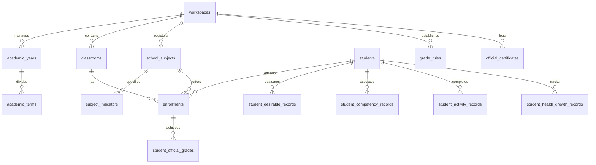

# แผนการเชื่อมต่อและปรับปรุงระบบงานทะเบียนและวิชาการ (System Specification Integration Plan)
**ClassCare 360 — Academic & Registrar Modernization**
*อัปเดต: 2026-09-08*
*เอกสารอ้างอิงหลัก:* `ระบบทะเบียนและงานวิชาการโรงเรียน_System_Specification.md`

---

## 1. บทนำและวัตถุประสงค์ (Executive Summary)

เอกสารฉบับนี้จัดทำขึ้นเพื่อเป็น **แผนแม่บท (Master Blueprint)** ในการพัฒนาและยกระดับระบบ **ClassCare 360** ให้สอดคล้องสมบูรณ์ตามข้อกำหนดของเอกสาร `ระบบทะเบียนและงานวิชาการโรงเรียน_System_Specification.md`

### ปรัชญาการออกแบบหลัก:
1. **Database-Centric:** ข้อมูลทุกอย่างจัดเก็บในฐานข้อมูลกลางที่สัมพันธ์กัน (Relational Schema) เลิกใช้รูปแบบ 1 Sheet = 1 หน้าของ Excel
2. **Single Source of Truth:** กรอกข้อมูลต้นทางครั้งเดียว (Single Entry Point) แล้วกระจายข้อมูลไปยังแดชบอร์ด, การประเมินผล, และเอกสารทางการทั้งหมดโดยอัตโนมัติ
3. **Student 360 Degree:** ข้อมูลนักเรียนคนเดียวเชื่อมโยงประวัติการเรียน, เวลาเรียน, คุณลักษณะ, สมรรถนะ, กิจกรรม, และการเจริญเติบโตทางกายภาพ
4. **Historical Preservation:** ข้อมูลของแต่ละปีการศึกษาต้องถูกล็อกและเก็บรักษาประวัติย้อนหลัง ไม่มีการเขียนทับข้อมูลเก่าเมื่อขึ้นปีการศึกษาใหม่
5. **Multi-Tenancy & Workspace Isolation:** คงโครงสร้างความปลอดภัย RLS เดิมของ ClassCare 360 โดยทุกตารางต้องผูกกับ `workspace_id` อย่างเคร่งครัด

---

## 2. ตารางวิเคราะห์เปรียบเทียบสถานะระบบ (Gap Analysis)

| # | หมวดหมู่ฟังก์ชัน | สถานะปัจจุบันใน ClassCare 360 | สิ่งที่ต้องพัฒนาเพิ่มตามข้อกำหนด (Gaps) | ระดับความสำคัญ |
|---|---|---|---|:---:|
| **1** | **ปีการศึกษาและภาคเรียน** | เก็บเป็นข้อความ string ใน Workspace/Classroom | ตาราง `academic_years` และ `academic_terms` พร้อมสถานะเปิด/ปิด/ล็อกเทอม | สูง (P1) |
| **2** | **รายวิชาและตัวชี้วัด** | พิมพ์ชื่อวิชาแบบ Free-form ใน `score_assessments` | ตารางกลาง `school_subjects` (8 กลุ่มสาระ สพฐ., รหัสวิชา, หน่วยกิต, ชม./ปี), `subject_indicators` (มาตรฐาน/ตัวชี้วัด) | สูง (P1) |
| **3** | **เกณฑ์ตัดเกรด & บันทึกผลทางการ** | คำนวณตัดเกรด 0-4 สดใน UI แบบตายตัว | ตาราง `grade_rules` (เกณฑ์ตัดเกรดปรับแก้ได้ของโรงเรียน) และ `student_official_grades` (สแนปช็อตผลการเรียนที่อนุมัติแล้ว) | สูง (P1) |
| **4** | **สมรรถนะสำคัญ 5 ประการ** | ยังไม่มีตารางเฉพาะ | ตาราง `student_competency_records` (สื่อสาร, คิด, แก้ปัญหา, ทักษะชีวิต, เทคโนโลยี ระดับ 0-3) | ปานกลาง (P2) |
| **5** | **กิจกรรมพัฒนาผู้เรียน** | ยังไม่มีตารางเฉพาะ | ตาราง `student_activity_records` (แนะแนว, ลูกเสือ/เนตรนารี, ชุมนุม, สาธารณประโยชน์ ผล 'ผ'/'มผ') | ปานกลาง (P2) |
| **6** | **คุณลักษณะอันพึงประสงค์ 8 ด้าน** | มีแล้วใน Migration `0066` (`student_desirable_records`) + อ่านคิดวิเคราะห์เขียน | สมบูรณ์แล้ว นำข้อมูลไปเชื่อมลง ปพ.5 และ ปพ.6 | เสร็จแล้ว (P0) |
| **7** | **สุขภาพและโภชนาการตามเกณฑ์กรมอนามัย** | บันทึกน้ำหนัก-ส่วนสูง และคำนวณ BMI พื้นฐาน | ระบบคำนวณ 3 เกณฑ์กรมอนามัย (น้ำหนัก/อายุ, ส่วนสูง/อายุ, น้ำหนัก/ส่วนสูง) + อายุอัตโนมัติ (ปี/เดือน) + วัด 2 รอบ/เทอม | ปานกลาง (P2) |
| **8** | **เอกสาร ปพ.5 (สมุดบันทึกผลการพัฒนาฯ)** | มีส่งออก Excel บางส่วน | ตัวสร้าง **ปพ.5 รายชั้น** และ **ปพ.5 รายวิชา** พร้อมหน้าปก, ตารางสรุป และช่องลงนาม 4 ฝ่าย (Print/PDF/Excel) | สูง (P1) |
| **9** | **เอกสาร ปพ.6 (สมุดรายงานประจำตัวนักเรียน)** | มีรายงานผลรายบุคคลแบบสรุป | เล่มรายงาน ปพ.6 แบบครบวงจร (Multi-page/Booklet) ดึงผลการเรียน, เวลาเรียน, สุขภาพ, คุณลักษณะ, ความเห็นครู และผู้ปกครอง | สูง (P1) |
| **10** | **เอกสารใบรับรองการศึกษา** | ยังไม่มีระบบออกเอกสาร | ออกใบรับรองการเป็นนักเรียน และใบรับรองผลการเรียน (รันเลขที่หนังสือ, ตราครุฑ/ตราโรงเรียน, สั่งพิมพ์) | ปานกลาง (P2) |
| **11** | **ระบบปิดภาคเรียนและเลื่อนชั้นเรียน** | จัดการห้องเรียนรายปีได้ | ระบบตรวจสอบความพร้อมก่อนปิดเทอม (Validation Engine) + Wizard ช่วยเลื่อนชั้นนักเรียนโดยไม่ทับข้อมูลเก่า | ปานกลาง (P2) |

---

## 3. แผนการดำเนินงาน 5 ระยะ (Phased Implementation Roadmap)

```text
┌────────────────────────────────────────────────────────────────────────┐
│ Phase 1: Academic Master Foundation (โครงสร้างปีการศึกษา รายวิชา เกณฑ์เกรด)    │
└───────────────────────────────────┬────────────────────────────────────┘
                                    ▼
┌────────────────────────────────────────────────────────────────────────┐
│ Phase 2: Competencies & Activities (สมรรถนะสำคัญ 5 ด้าน & กิจกรรมพัฒนา)    │
└───────────────────────────────────┬────────────────────────────────────┘
                                    ▼
┌────────────────────────────────────────────────────────────────────────┐
│ Phase 3: Thai DOH Nutrition Engine (ระบบโภชนาการ 3 เกณฑ์กรมอนามัย)      │
└───────────────────────────────────┬────────────────────────────────────┘
                                    ▼
┌────────────────────────────────────────────────────────────────────────┐
│ Phase 4: Official Document Engine (ปพ.5 รายชั้น/รายวิชา, ปพ.6, ใบรับรอง)    │
└───────────────────────────────────┬────────────────────────────────────┘
                                    ▼
┌────────────────────────────────────────────────────────────────────────┐
│ Phase 5: Term Lifecycle & Grade Promotion Wizard (การปิดเทอม & เลื่อนชั้น) │
└────────────────────────────────────────────────────────────────────────┘
```

---

### ระยะที่ 1: Academic Master Foundation (โครงสร้างวิชาการกลาง)
**เป้าหมาย:** สถาปนาโครงสร้างข้อมูลหลักสูตรและรายวิชา เพื่อให้ระบบเลิกใช้การพิมพ์ชื่อวิชาแบบข้อความอิสระ

#### 1. งานฐานข้อมูล (Database Migrations):
- **ตาราง `academic_years` & `academic_terms`**:
  - `workspace_id` (uuid)
  - `year_name` (text, เช่น '2569')
  - `start_date`, `end_date` (date)
  - `is_current` (boolean)
  - `status` (text: 'open', 'locked', 'closed')
- **ตาราง `school_subjects`**:
  - `workspace_id` (uuid)
  - `subject_code` (text, เช่น 'ท11101')
  - `subject_name` (text, เช่น 'ภาษาไทย 1')
  - `learning_area` (text, เช่น 'ภาษาไทย', 'คณิตศาสตร์', ...)
  - `grade_level` (text, เช่น 'ประถมศึกษาปีที่ 1')
  - `hours_per_year` (numeric, เช่น 200)
  - `hours_per_week` (numeric, เช่น 5)
  - `credit` (numeric, เช่น 2.5)
  - `is_active` (boolean)
- **ตาราง `subject_indicators`**:
  - `subject_id` (uuid references school_subjects)
  - `standard_code` (text, เช่น 'ท 1.1')
  - `indicator_code` (text, เช่น 'ป.1/1')
  - `indicator_name` (text)
  - `term` (text: '1', '2', 'yearly')
- **ตาราง `grade_rules`**:
  - `workspace_id` (uuid)
  - `min_score` (numeric, e.g. 80.00)
  - `max_score` (numeric, e.g. 100.00)
  - `grade` (text, e.g. '4')
  - `description` (text, e.g. 'ดีเยี่ยม')
- **ตาราง `student_official_grades`**:
  - บันทึกผลการเรียนที่อนุมัติเป็นทางการรายนักเรียน + รายวิชา + ปีการศึกษา + เทอม

#### 2. งานหน้าจอผู้ใช้งาน (UI):
- เพิ่มแท็บ **"โครงสร้างวิชาและหลักสูตร"** ในหน้า System Setup / Workspace Settings
- ปรับปรุงหน้า `ScoresPage.tsx` ให้สามารถเลือกวิชาจาก `school_subjects` ได้ทันที
- UI หน้าตั้งค่าเกณฑ์การตัดเกรดของโรงเรียน

---

### ระยะที่ 2: Competencies & Activities (สมรรถนะสำคัญและกิจกรรมพัฒนาผู้เรียน)
**เป้าหมาย:** บันทึกการประเมินผู้เรียนครบทุกมิติตามหลักสูตรแกนกลาง สพฐ. 2551

#### 1. งานฐานข้อมูล (Database Migrations):
- **ตาราง `student_competency_records`**:
  - `workspace_id`, `classroom_id`, `student_id`, `academic_year`, `term`
  - `comp_1` (smallint, 0-3): ความสามารถในการสื่อสาร
  - `comp_2` (smallint, 0-3): ความสามารถในการคิด
  - `comp_3` (smallint, 0-3): ความสามารถในการแก้ปัญหา
  - `comp_4` (smallint, 0-3): ความสามารถในการใช้ทักษะชีวิต
  - `comp_5` (smallint, 0-3): ความสามารถในการใช้เทคโนโลยี
  - `comp_summary` (smallint, 0-3): สรุปผลสมรรถนะ
- **ตาราง `student_activity_records`**:
  - `act_guidance` (text, 'pass'/'fail'/'none'): กิจกรรมแนะแนว
  - `act_scout` (text, 'pass'/'fail'/'none'): กิจกรรมลูกเสือ-เนตรนารี
  - `act_club` (text, 'pass'/'fail'/'none'): กิจกรรมชุมนุม/ชมรม
  - `act_social` (text, 'pass'/'fail'/'none'): กิจกรรมเพื่อสังคมและสาธารณประโยชน์
  - `act_summary` (text, 'pass'/'fail'/'none'): สรุปผลกิจกรรม

#### 2. งานหน้าจอผู้ใช้งาน (UI):
- ขยายหน้า `DesirableCharacteristicsPage.tsx` ให้มีแท็บ:
  1. คุณลักษณะอันพึงประสงค์ 8 ด้าน (มีอยู่แล้ว)
  2. อ่าน คิดวิเคราะห์ และเขียน (มีอยู่แล้ว)
  3. **สมรรถนะสำคัญ 5 ประการ** (เพิ่มใหม่ พร้อมปุ่มด่วน "ตั้งต้นเป็นดีเยี่ยมทุกคน")
  4. **กิจกรรมพัฒนาผู้เรียน** (เพิ่มใหม่ พร้อมปุ่มด่วน "ผ่านเกณฑ์ทุกคน")
  5. **สรุปผลรวมส่ง ปพ.5**

---

### ระยะที่ 3: Thai DOH Nutrition Engine (ระบบสุขภาพและโภชนาการตามเกณฑ์กรมอนามัย)
**เป้าหมาย:** ประเมินการเจริญเติบโตทางกายภาพของนักเรียนตามเกณฑ์อ้างอิงการเจริญเติบโตของเด็กไทย

#### 1. งานคำนวณและเกณฑ์อ้างอิง:
- คำนวณอายุอัตโนมัติ: `(วันชั่งน้ำหนัก - วันเกิด) = X ปี Y เดือน`
- เกณฑ์อ้างอิงการเจริญเติบโตของเด็กอายุ 5-19 ปี (กรมอนามัย กระทรวงสาธารณสุข):
  1. **น้ำหนักตามเกณฑ์อายุ (W/A):** น้ำหนักน้อยกว่าเกณฑ์ / ค่อนข้างน้อย / ตามเกณฑ์ / ค่อนข้างมาก / เกินเกณฑ์
  2. **ส่วนสูงตามเกณฑ์อายุ (H/A):** เตี้ย / ค่อนข้างเตี้ย / สูงตามเกณฑ์ / ค่อนข้างสูง / สูงกว่าเกณฑ์
  3. **น้ำหนักตามเกณฑ์ส่วนสูง (W/H):** ผอม / ค่อนข้างผอม / สมส่วน / ท้วม / เริ่มอ้วน / อ้วน
- รองรับการบันทึก **2 ครั้งต่อภาคเรียน** (ต้นภาคเรียน / ปลายภาคเรียน)

#### 2. งานหน้าจอผู้ใช้งาน (UI):
- อัปเกรด `StudentHealthPage.tsx` ให้แสดง Badge ผลการประเมิน 3 เกณฑ์ทันทีที่พิมพ์น้ำหนักและส่วนสูง
- หน้าจอสรุป **ความชุก (Prevalence)**:
  - สรุปภาพรวมห้องเรียนและโรงเรียน: ร้อยละของเด็กสมส่วน, เตี้ย, อ้วน, ผอม
  - ส่งออกข้อมูลสถิติสุขภาพส่งฝ่ายอนามัยโรงเรียน

---

### ระยะที่ 4: Official Document Engine (ระบบเอกสาร ปพ.5, ปพ.6 และใบรับรอง)
**เป้าหมาย:** สร้างเอกสารทางการที่ถูกต้องตามระเบียบ สพฐ. พิมพ์หรือออกเป็น PDF/Excel ได้ทันที

#### 1. ปพ.5 รายชั้น (Homeroom Quality Record Book):
- **หน้าปก:** ตราโรงเรียน/ตราสัญลักษณ์, ชื่อโรงเรียน, สังกัด (สพป./สพม.), ปีการศึกษา, ชื่อครูประจำชั้น
- **ส่วนที่ 1:** บัญชีรายชื่อและข้อมูลพื้นฐานนักเรียน
- **ส่วนที่ 2:** สรุปสถิติเวลาเรียนประจำปี (ร้อยละการมาเรียน)
- **ส่วนที่ 3:** สรุปผลการประเมินการเรียนรู้ทุกรายวิชา (คะแนนรวม, เกรด, ผลการตัดสิน)
- **ส่วนที่ 4:** สรุปผลการประเมินคุณลักษณะอันพึงประสงค์ และอ่าน คิดวิเคราะห์ เขียน
- **ส่วนที่ 5:** สรุปผลการประเมินสมรรถนะสำคัญ และกิจกรรมพัฒนาผู้เรียน
- **ส่วนที่ 6:** บันทึกการอนุมัติและลายมือชื่อ 4 ฝ่าย (ครูประจำชั้น, หัวหน้างานวิชาการ, หัวหน้าฝ่ายบริหาร, ผู้อำนวยการโรงเรียน)

#### 2. ปพ.5 รายวิชา (Subject Quality Record Book):
- **หน้าปก:** รหัสวิชา, ชื่อวิชา, กลุ่มสาระฯ, ระดับชั้น, ภาคเรียน/ปีการศึกษา, ชื่อครูผู้สอน
- **ส่วนที่ 1:** โครงสร้างรายวิชา คำอธิบายรายวิชา และตัวชี้วัด/ผลการเรียนรู้
- **ส่วนที่ 2:** เกณฑ์การวัดและประเมินผล (คะแนนระหว่างเรียน : คะแนนสอบ)
- **ส่วนที่ 3:** ตารางบันทึกคะแนนเก็บรายหน่วย/รายตัวชี้วัด และการประเมินผ่าน/ไม่ผ่าน
- **ส่วนที่ 4:** สรุปผลการเรียน เกรด 0-4 และสถิติการกระจายตัวของผลการเรียน (SD, Mean)
- **ส่วนที่ 5:** บันทึกการอนุมัติและลายมือชื่อ (ครูผู้สอน, หัวหน้ากลุ่มสาระ, หัวหน้าวิชาการ, ผู้อำนวยการ)

#### 3. ปพ.6 (แบบรายงานผลการพัฒนาคุณภาพผู้เรียนรายบุคคล / สมุดพก):
- รูปแบบเล่มพับ (A4 แนวนอนพับครึ่ง 4 หน้า) หรือรายงานพิมพ์หน้า-หลัง
- หน้ารวมข้อมูล 360 องศา:
  - ประวัตินักเรียน, ข้อมูลบิดามารดา/ผู้ปกครอง
  - สรุปผลการเรียนทุกรายวิชา (คะแนน, เกรด, ผลการประเมิน)
  - สรุปเวลาเรียน (วันมา, วันลา, วันขาด, ร้อยละ)
  - สรุปผลประเมินคุณลักษณะ 8 ประการ, สมรรถนะ 5 ด้าน, กิจกรรมพัฒนาผู้เรียน
  - บันทึกการเจริญเติบโตทางร่างกายและสุขภาพ
  - ความเห็นของครูประจำชั้น (มี AI ช่วยร่างความเห็นเชิงบวก)
  - ช่องบันทึกความเห็นและลงชื่อของผู้ปกครอง

#### 4. ระบบออกใบรับรองการศึกษา (Certificates):
- **ใบรับรองการเป็นนักเรียน:** ยืนยันการศึกษาในชั้นปัจจุบัน
- **ใบรับรองผลการเรียน (Transcript):** แสดงผลการเรียนรายวิชาที่ผ่านมา
- ฟีเจอร์:
  - ออกเลขที่หนังสือราชการอัตโนมัติ (เช่น ที่ ศธ xxxx/ว.xx)
  - ประทับตราครุฑหรือตราโรงเรียน
  - วันที่แบบทางการไทย (เช่น วันที่ ๘ กันยายน พ.ศ. ๒๕๖๙)
  - ระบบจัดเก็บประวัติการออกใบรับรอง (Audit Log)

---

### ระยะที่ 5: Term Lifecycle & Grade Promotion Wizard (การปิดภาคเรียนและเลื่อนชั้น)
**เป้าหมาย:** บริหารจัดการวงจรปีการศึกษา การตรวจสอบความสมบูรณ์ และการเลื่อนชั้นเรียนโดยไม่กระทบประวัติเดิม

#### 1. Validation Engine ก่อนปิดภาคเรียน:
- ตรวจสอบความถูกต้อง (Pre-closing Audit Checklist):
  - [ ] ตรวจพบนักเรียนที่มีคะแนนไม่ครบทุกหน่วยการเรียนรู้
  - [ ] ตรวจพบนักเรียนที่มีเวลาเรียนต่ำกว่า 80%
  - [ ] ตรวจพบวิชาที่ยังไม่ได้ตัดเกรด หรือยังไม่มีการประเมินตัวชี้วัด
  - [ ] ตรวจพบการประเมินคุณลักษณะหรือกิจกรรมที่ยังว่างอยู่
- หากข้อมูลครบถ้วน: ฝ่ายวิชาการสามารถสั่ง **"ล็อกผลการเรียน (Lock Term Data)"** ห้ามแก้ไข

#### 2. Grade Promotion Wizard (ระบบช่วยเลื่อนชั้นเรียน):
- ขั้นตอนการทำงาน:
  1. สรุปผลการตัดสินเลื่อนชั้น (ผ่านทุกวิชาพื้นฐาน, ผ่านคุณลักษณะ, ผ่านกิจกรรม)
  2. เลือกปลายทางชั้นเรียนใหม่:
     - ป.1/1 (ปี 2568) ➡️ เลื่อนเป็น ป.2/1 (ปี 2569)
     - ป.6 (ปี 2568) ➡️ เปลี่ยนสถานะเป็น "จบการศึกษา (Graduated)"
     - กรณีตกซ้ำชั้น ➡️ คงอยู่ที่ระดับเดิม
  3. สร้างปีการศึกษาใหม่และคัดลอกโครงสร้าง (Clone Classrooms & Subjects) โดย **ไม่คัดลอกคะแนนเก่า**
  4. ประวัติของปีก่อนหน้ายังคงเปิดดูและพิมพ์ ปพ. ย้อนหลังได้ตลอดเวลา

---

## 4. แผนผังความสัมพันธ์ของข้อมูล (Database Entity-Relationship)



---

## 5. แผนการตรวจสอบและทดสอบระบบ (Verification Checklist)

- [ ] **Data Isolation (RLS):** ทุกคำสั่ง Query ในตารางใหม่ต้องติด `workspace_id = auth.current_workspace_id`
- [ ] **Grade Rule Calculation:** คะแนน 79.5 ต้องตัดเกรดถูกต้องตามเกณฑ์ (เช่น 3.5 หรือ 4 ตามกฎการปัดเศษของโรงเรียน)
- [ ] **Thai DOH Nutrition Standard:** ผลการทดสอบคำนวณอายุและเกณฑ์ 3 ด้านของเด็กชาย/หญิงตรงตามตารางมาตรฐานของกรมอนามัย
- [ ] **Official Printing Layout:** พิมพ์แบบ ปพ.5 และ ปพ.6 ออกทางเครื่องพิมพ์กระดาษ A4 ไม่ล้นหน้า ขอบกระดาษ 1.5 - 2 ซม. สวยงาม
- [ ] **Promotion Integrity:** รันระบบเลื่อนชั้นแล้ว ตรวจสอบว่าเกรดและคะแนนของปีการศึกษาเดิมยังคงอยู่ครบถ้วน ไม่ถูกลบหรือเขียนทับ

---

## 6. สรุปการส่งมอบและตำแหน่งไฟล์ในโปรเจกต์

| ไฟล์ / โฟลเดอร์ | หน้าที่ |
|---|---|
| `docs/SYSTEM_SPECIFICATION_INTEGRATION_PLAN.md` | เอกสารแผนแม่บทการเชื่อมต่อระบบ (ไฟล์นี้) |
| `ระบบทะเบียนและงานวิชาการโรงเรียน_System_Specification.md` | เอกสารข้อกำหนดระบบต้นฉบับ |
| `supabase/migrations/` | โฟลเดอร์เก็บไฟล์ Migration สำหรับตารางใหม่ที่จะสร้างตามแผนงาน |
| `src/pages/app/` | ซอร์สโค้ดหน้าจอหลักของระบบ ClassCare 360 |
| `src/lib/` | โมดูลคำนวณเกรด, การส่งออก Excel, และเทมเพลตเอกสารทางการ |
